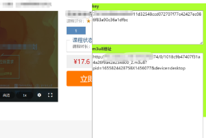

# chrome_extensions

谷歌插件开发

videocc-download.zip 为插件，
下载后，解压。

不要使用右键另存为下载,否则下载的就是个网页，点击文件进入下一级目录再下载

使用chrome浏览器或者其它使用相同内核的浏览器，进入开发者模式，选择加载已解压的扩展程序，安装插件。

获取到key 后，可以使用  https://github.com/HeiSir2014/M3U8-Downloader M3U8-Downloader下载m3u8

目前只针对指定网站获取，而我知道的网站有限，如果您的网站不在下面目录，请留言

当前支持的网站：

www.sciconf.cn

www.weplanning.cn

www.wyzc.com

www.shenlanxueyuan.com

www.mashibing.com

www.luffycity.com

使用方法：

1.安装插件

2.进入对应的视频页面

3.在显示的窗口内复制key以及m3u8地址

4.使用M3U8-Downloader下载

###### 

**界面显示**

---
